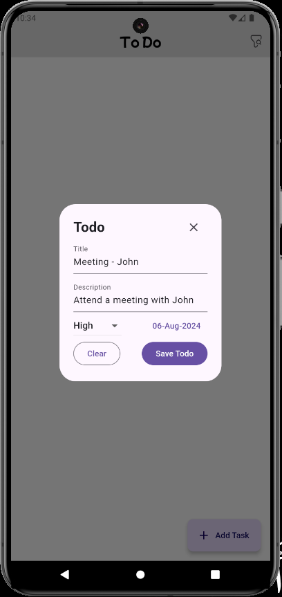
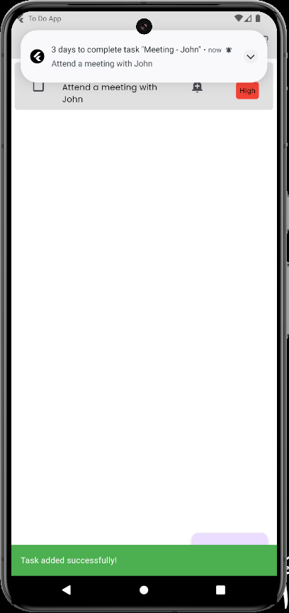
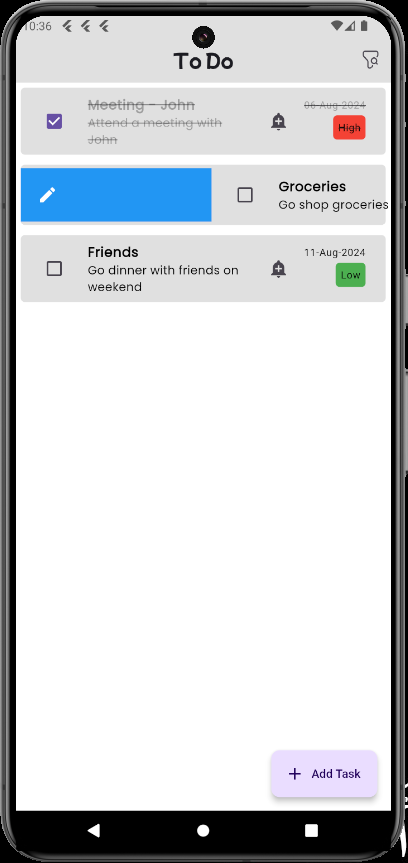
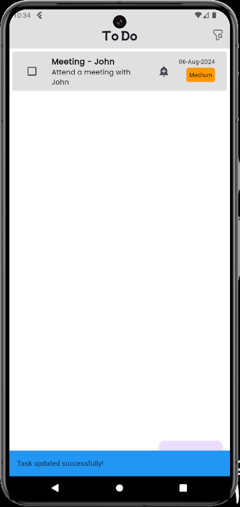
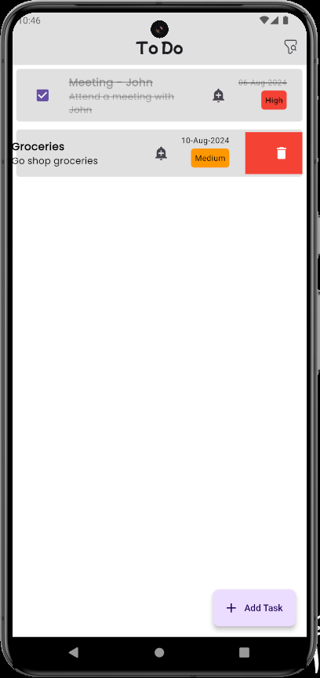
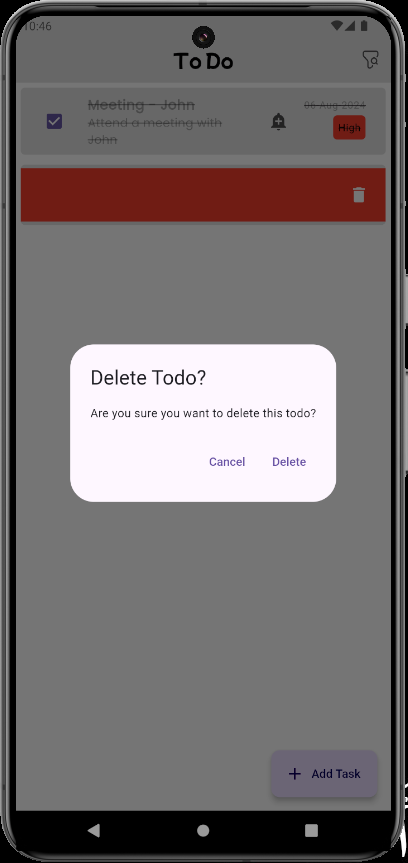
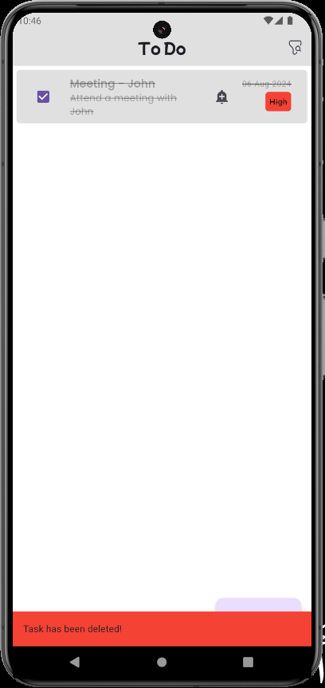
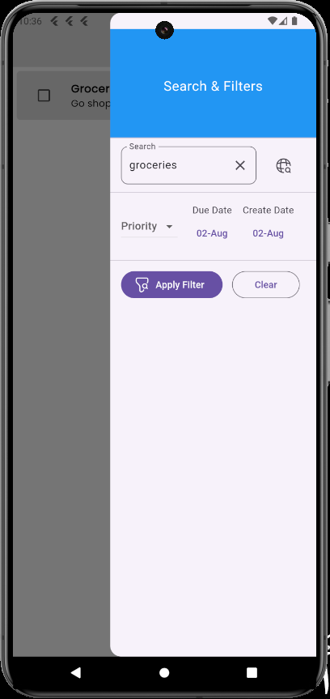

# Todo Flutter App

This is a simple todo app made with flutter. It uses the GetX package for state management.

## Features

- Add a todo
- Mark a todo as done
- Delete a todo
- Edit a todo
- Search for a todo
- Filter todos by priority, Due date, and Creation date

## Dependencies

- [GetX](https://pub.dev/packages/get)
- [intl](https://pub.dev/packages/intl)
- [hive](https://pub.dev/packages/hive)
- [hive_flutter](https://pub.dev/packages/hive_flutter)
- [google_fonts](https://pub.dev/packages/google_fonts)
- [awesome_notifications](https://pub.dev/packages/awesome_notifications)

## Screenshots

<table>
<tr>
<td></td>
<td></td>
<td>

</td>
<td>

</td>
</tr>
<td>

</td>
<td>

</td>
<td>

</td>
<td>

</td>
</tr>
</table>
## Getting Started

1. Clone the repository

```bash
git clone
```

2. Install dependencies

```bash
flutter pub get
```

3. Run the app

```bash
flutter run
```

# Todo-App

A new Flutter project.

## Getting Started

This project is a starting point for a Flutter application.
